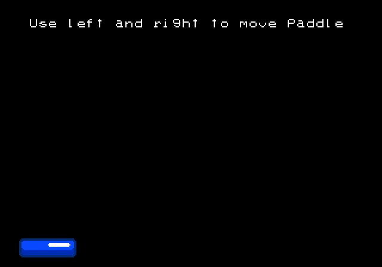

# Moving a Sprite Around

Most of the code examples for the remainder of the book will have us gradually building up a simple game of breakout. The final game will look like this

<< screenshot of final breakout >>

In this chapter we will simply add the paddle on screen and enable moving it left and right with the joystick, and it will look like this



You can see this chapter's final code at [this branch](https://github.com/city41/neo-geo-dev-book-game/tree/06-moving-a-sprite-around) in the book's companion game repo. Take a look at [main.c](https://github.com/city41/neo-geo-dev-book-game/blob/06-moving-a-sprite-around/src/main.c) and you will see the overall structure of the code is similar to the hello world code, and functions like `fix_clear` and `fix_print` haven't changed. So we'll just focus on the new stuff.

If you are following along in your own codebase, you can use the hello world app as a starting point. Either copy the entire project directory to a new location, or check out a new branch if you are using source control.

## Using sromcrom to generate our palettes

A real Neo Geo game has lots of graphics, and normally they are constructed from modern image files such as pngs. Creating the palettes for all these images manually like we did in the hello world app is not feasible at all. Thankfully, when sromcrom generates our C ROM and S ROM tiles, it also figures out what the palettes need to be for all of the images it is given.

Having Sromcrom generate the S and C ROM files for us is handy, but it's not enough in a real game. Our game code needs to know which tile is which. Loading these files in the tile viewer and manually writing the tile indices into our code is not realistic for a large game. Especially considering everytime you add a new image into the mix, the tile indices will likely all change!

To handle this, sromcrom can also generate source code. Since our app is written in C, we will create C code templates to give to sromcrom. It will use these templates to generate the code. For this app, we are only going to do this for the palettes. 

In `resources.json`, lets tell sromcrom about our palette templates

```json
{
    "romPathRoot": "../src/rom/202-",
    "palettes": {
        "codeEmit": [
            {
                "template": "../src/sromcromTemplates/paletteDefs.h.ejs",
                "dest": "../src/paletteDefs.h"
            },
            {
                "template": "../src/sromcromTemplates/paletteDefs.c.ejs",
                "dest": "../src/paletteDefs.c"
            }
        ]
    },
    "sromImages": {
            "inputs": [
                {
                        "name": "font",
                        "imageFile": "./fixFont.png"
                    }
            ]
    },
}
```

Here we are telling sromcrom to use our templates to generate `paletteDefs.h` and `paletteDefs.c`. Our templates will get passed the palette data that sromcrom generated, and we use this data to write out the palette code. The header file template is quite simple

```ejs
#pragma once
#include <ngdevkit/neogeo.h>

#define NUM_PALETTES <%= palettes.length %>
#define NUM_PALETTE_ENTRIES <%= palettes.flat(1).length %>

const u16 palettes[NUM_PALETTE_ENTRIES];
```

As you can see it is almost a normal header file. But everytime there is a `<%` `%>` pair, the template switches to JavaScript code. In the JavaScript environment, we have a `palettes` array, containing the data for our palettes. Using this we can generate our header file, which ends up looking like this

```c
#pragma once
#include <ngdevkit/neogeo.h>

#define NUM_PALETTES 3
#define NUM_PALETTE_ENTRIES 48

const u16 palettes[NUM_PALETTE_ENTRIES];
```

The template file for the C code is a tad more complex. It uses a for loop to write all of the palette values into the C file

```ejs
#include "paletteDefs.h"

const u16 palettes[NUM_PALETTE_ENTRIES] = {
<% palettes.forEach(function(palette, i, a) { -%>
    // palette <%= i %>
    <%= palette.map(c => '0x' + c.toString(16)).join(', ') %><% if (i < a.length - 1) { %>,<%}%>
<% }); -%>
};
```

Resulting in this C file

```c
#include "paletteDefs.h"

const u16 palettes[NUM_PALETTE_ENTRIES] = {
    // palette 0
    0x8000, 0x8000, 0x8000, 0x8000, 0x8000, 0x8000, 0x8000, 0x8000, 0x8000, 0x8000, 0x8000, 0x8000, 0x8000, 0x8000, 0x8000, 0x8000,
    // palette 1
    0x5f0f, 0x7fff, 0x8000, 0x8000, 0x8000, 0x8000, 0x8000, 0x8000, 0x8000, 0x8000, 0x8000, 0x8000, 0x8000, 0x8000, 0x8000, 0x8000,
    // palette 2
    0x5f0f, 0x3b, 0x1037, 0x5fff, 0x704f, 0x8000, 0x8000, 0x8000, 0x8000, 0x8000, 0x8000, 0x8000, 0x8000, 0x8000, 0x8000, 0x8000
};
```

The templating language being used is [Embedded JavaScript](https://ejs.co/).

Now that we have our palette code all squared away, let's add `paletteDefs` as an object in our Makefile, so we compile this new code into our game. In the Makefile, change the line near the top which reads `OBJS=main paletteDefs` to this

```Makefile
...
OBJS=main paletteDefs
ELF=rom.elf
...
```

That line is the only change we need to make in the Makefile.
 
## init_palette()

Since we are initializing more than one palette, we'll change the name to be plural. The code is almost the same as before, but rather than loading our simple hardcoded palette, we will load the palettes defined in `paletteDefs.c`.

Up near the top of `main.c` add `#include "paletteDefs.h", then `init_palettes` is simply

```c
void init_palettes() {
    for (u8 i = 0; i < NUM_PALETTE_ENTRIES; ++i) {
        MMAP_PALBANK1[i] = palettes[i];
    }
}
```

## Define our paddle entity

Let's define a simple struct then create one instance of it to keep track of our paddle

```c
struct Paddle {
    s16 x;
    s16 y;
};

struct Paddle paddle = {
    .x = 16,
    .y = 200
};
```

Since our paddle struct is not `const`, its values can be changed. That means it will get loaded into the 68k's main 32kb of memory. Understanding `const` and its implications on how the P ROM is built and how the 32kb of RAM gets used is important, so much so the next chapter will go into a lot of detail on it. 

## Our game loop

Let's jump ahead a bit and take a look at `main()`

```c
int main() {
    init_palettes();
    fix_clear();
    
    fix_print(3, 4, "Use left and right to move paddle");
    load_paddle();

    for (;;) {
        if (bios_p1current & CNT_LEFT) {
            paddle.x -= 1;
        }

        if (bios_p1current & CNT_RIGHT) {
            paddle.x += 1;
        }
        
        wait_vblank();
        move_paddle();
    }

    return 0;
}
```

The beginning looks familiar, we are initializing things just like we did in hello world. We also initialize our paddle's sprites with `load_paddle()`. But this time the `for` loop is no longer empty. Here we have defined a very simple game loop of

* read inputs and move the paddle accordingly
* draw the paddle on screen at its current location

### Reading the joystick

`bios_p1current` is a byte which has the current state of player one's joystick. Each bit in the byte is one direction on the joystick, plus the four main buttons A, B, C, and D

<< diagram showing how bios_p1current is laid out >>

This byte is defined in ngdevkit and a few things need to happen to populate it. We will ignore how all that works for now, just know that every frame, this byte contains the current state of the joystick.

We can check if the joystick's left or right direction is pressed by checking if the corresponding bits are set in the byte. That is all the if statements are doing. If left or right is pressed, we will move our paddle's x location accordingly.

## Waiting for vblank

As we touched upon briefly in the graphics overview, it is important to only change VRAM values when the screen is not being drawn. There is only a very brief window to do this, when the electron beam in the monitor is traveling from the bottom of the screen back to the top. This window is known as vertical blank, or vblank. The Neo Geo fires an interrupt whenever vblank begins. An interrupt is a mechanism that allows the BIOS to get our game's attention. There are many different interrupts that can be triggered, we'll dig into those details later.

ngdevkit is handling the vblank interrupt for us and providing us with a nice simple hook that lets us know that vblank has occurred. That is what the `rom_callback_Vblank` function is. This function needs to be named exactly that, as the name is how ngdevkit is able to find it.

```c
volatile u8 vblank=0;

void rom_callback_VBlank() {
    vblank=1;
}

void wait_vblank() {
    while (!vblank);
    vblank=0;
}
```

<div class="callout">
The volatile keyword in C lets the compiler know that something else in the system can change this value. In our case, that "something else" is the BIOS invoking the vblank interrupt, which the compiler knows nothing about. volatile tells the compiler "this variable can be changed by something external, so don't make any assumptions about its value".
</div>

We have a simple byte to keep track of vblank, and our ngdevkit callback function will set it every vblank. `wait_vblank` is waiting for this value to get tripped to 1, and when it does, we know vblank has just occurred. Once `wait_vblank()` returns in our code, we know we are now in that brief vblank window, and can safely change VRAM, which is what we are doing at the bottom of the `for` loop

```c
wait_vblank();
move_paddle();
```

<div class="callout">
How do we know if we are doing all of our VRAM changes before vblank ends? There's no explicit way to know this, but there is a trick we will explore later in the book that can help us
</div>

## load_paddle and move_paddle

Finally, we need to write our VRAM functions that will first load our paddle sprites, then move them in response to joystick presses.


