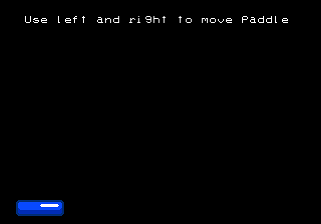

Most of the code examples for the remainder of the book will have us gradually building up a simple game of breakout. The final game will look like this

<< screenshot of final breakout >>

In this chapter we will simply add the paddle on screen and enable moving it left and right with the joystick, and it will look like this



You can see this chapter's final code at [this branch](https://github.com/city41/neo-geo-dev-book-game/tree/06-moving-a-sprite-around) in the book's companion game repo. Take a look at [main.c](https://github.com/city41/neo-geo-dev-book-game/blob/06-moving-a-sprite-around/src/main.c) and you will see the overall structure of the code is similar to the hello world code, and functions like `fix_clear` and `fix_print` haven't changed. So we'll just focus on the new stuff.

If you are following along in your own codebase, you can use the hello world app as a starting point. Either copy the entire project directory to a new location, or check out a new branch if you are using source control.

## Using sromcrom to generate our palettes

A real Neo Geo game has lots of graphics, and normally they are constructed from modern image files such as pngs. Creating the palettes for all these images manually like we did in the hello world app is not feasible at all. Thankfully, when sromcrom generates our C ROM and S ROM tiles, it also figures out what the palettes need to be for all of the images it is given.

Having Sromcrom generate the S and C ROM files for us is handy, but it's not enough in a real game. Our game code needs to know which tile is which. Loading these files in the tile viewer and manually writing the tile indices into our code is not realistic for a large game. Especially considering everytime you add a new image into the mix, the tile indices will likely all change!

To handle this, sromcrom can also generate source code. Since our app is written in C, we will create C code templates to give to sromcrom. It will use these templates to generate the code. For this app, we are only going to do this for the palettes.

In `resources.json`, lets tell sromcrom about our palette templates

```json
{
	"romPathRoot": "../src/rom/202-",
	"palettes": {
		"codeEmit": [
			{
				"template": "../src/sromcromTemplates/paletteDefs.h.ejs",
				"dest": "../src/paletteDefs.h"
			},
			{
				"template": "../src/sromcromTemplates/paletteDefs.c.ejs",
				"dest": "../src/paletteDefs.c"
			}
		]
	},
	"sromImages": {
		"inputs": [
			{
				"name": "font",
				"imageFile": "./fixFont.png"
			}
		]
	}
}
```

Here we are telling sromcrom to use our templates to generate `paletteDefs.h` and `paletteDefs.c`. Our templates will get passed the palette data that sromcrom generated, and we use this data to write out the palette code. The header file template is quite simple

```ejs
#pragma once
#include <ngdevkit/neogeo.h>

#define NUM_PALETTES <%= palettes.length %>
#define NUM_PALETTE_ENTRIES <%= palettes.flat(1).length %>

const u16 palettes[NUM_PALETTE_ENTRIES];
```

As you can see it is almost a normal header file. But everytime there is a `<%` `%>` pair, the template switches to JavaScript code. In the JavaScript environment, we have a `palettes` array, containing the data for our palettes. Using this we can generate our header file, which ends up looking like this

```c
#pragma once
#include <ngdevkit/neogeo.h>

#define NUM_PALETTES 3
#define NUM_PALETTE_ENTRIES 48

const u16 palettes[NUM_PALETTE_ENTRIES];
```

The template file for the C code is a tad more complex. It uses `forEach()` to write all of the palette values into the C file

```ejs
#include "paletteDefs.h"

const u16 palettes[NUM_PALETTE_ENTRIES] = {
<% palettes.forEach(function(palette, i, a) { -%>
    // palette <%= i %>
    <%= palette.map(c => '0x' + c.toString(16)).join(', ') %><% if (i < a.length - 1) { %>,<%}%>
<% }); -%>
};
```

Resulting in this C file

```c
#include "paletteDefs.h"

const u16 palettes[NUM_PALETTE_ENTRIES] = {
    // palette 0
    0x8000, 0x8000, 0x8000, 0x8000, 0x8000, 0x8000, 0x8000, 0x8000, 0x8000, 0x8000, 0x8000, 0x8000, 0x8000, 0x8000, 0x8000, 0x8000,
    // palette 1
    0x5f0f, 0x7fff, 0x8000, 0x8000, 0x8000, 0x8000, 0x8000, 0x8000, 0x8000, 0x8000, 0x8000, 0x8000, 0x8000, 0x8000, 0x8000, 0x8000,
    // palette 2
    0x5f0f, 0x3b, 0x1037, 0x5fff, 0x704f, 0x8000, 0x8000, 0x8000, 0x8000, 0x8000, 0x8000, 0x8000, 0x8000, 0x8000, 0x8000, 0x8000
};
```

The templating language being used is [Embedded JavaScript](https://ejs.co/).

Now that we have our palette code all squared away, let's add `paletteDefs` as an object in our Makefile, so we compile this new code into our game. In the Makefile, change the line near the top which reads `OBJS=main` to this

```Makefile
...
OBJS=main paletteDefs
ELF=rom.elf
...
```

That line is the only change we need to make in the Makefile.

## init_palette()

Since we are initializing more than one palette, we'll change the name to be plural. The code is almost the same as before, but rather than loading our simple hardcoded palette, we will load the palettes defined in `paletteDefs.c`.

Up near the top of `main.c` add `#include "paletteDefs.h"`, then `init_palettes` is simply

```c
// this should be at the top with the other includes
#include "paletteDefs.h"

...

void init_palettes() {
    for (u8 i = 0; i < NUM_PALETTE_ENTRIES; ++i) {
        MMAP_PALBANK1[i] = palettes[i];
    }
}
```

## Define our paddle entity

Let's define a simple `Paddle` type then create one instance of it to keep track of our paddle

```c
struct Paddle {
    s16 x;
    s16 y;
};

struct Paddle paddle = {
    .x = 16,
    .y = 200
};
```

Since our paddle struct is not `const`, its values can be changed. That means it will get loaded into the 68k's main 32kb of memory. Understanding `const` and its implications on how the P ROM is built and how the 32kb of RAM gets used is important, so much so the next chapter will go into a lot of detail on it.

## Our game loop

Let's jump ahead a bit and take a look at `main()`

```c
int main() {
    init_palettes();
    fix_clear();

    fix_print(3, 4, "Use left and right to move paddle");
    load_paddle();

    for (;;) {
        if (bios_p1current & CNT_LEFT) {
            paddle.x -= 1;
        }

        if (bios_p1current & CNT_RIGHT) {
            paddle.x += 1;
        }

        wait_vblank();
        move_paddle();
    }

    return 0;
}
```

The beginning looks familiar, we are initializing things just like we did in hello world. We also initialize our paddle's sprites with `load_paddle()`. But this time the `for` loop is no longer empty. Here we have defined a very simple game loop of

- read inputs and move the paddle accordingly
- set the paddle sprite's new location in VRAM, so the LSPC can update the screen

### Reading the joystick

`bios_p1current` is a byte which has the current state of player one's joystick. Each bit in the byte is one direction on the joystick, plus the four main buttons A, B, C, and D

<< diagram showing how bios_p1current is laid out >>

This byte is defined in ngdevkit and a few things need to happen to populate it. We will ignore how all that works for now, just know that every frame, this byte contains the current state of the joystick.

We can check if the joystick's left or right direction is pressed by checking if the corresponding bits are set in the byte. That is all the if statements are doing. If left or right is pressed, we will move our paddle's x location accordingly.

## Waiting for vblank

As we touched upon briefly in the graphics overview, it is important to only change VRAM values when the screen is not being drawn. There is only a very brief window to do this, when the electron beam in the monitor is traveling from the bottom of the screen back to the top. This window is known as vertical blank, or vblank. The Neo Geo fires an interrupt whenever vblank begins. An interrupt is a mechanism that allows the BIOS to get our game's attention. There are many different interrupts that can be triggered, we'll dig into those details later.

ngdevkit is handling the vblank interrupt for us and providing us with a nice simple hook that lets us know that vblank has occurred. That is what the `rom_callback_Vblank` function below is. This function needs to be named exactly that, as the name is how ngdevkit is able to find it.

```c
volatile u8 vblank = 0;

void rom_callback_VBlank() {
    vblank = 1;
}

void wait_vblank() {
    while (!vblank);

    vblank = 0;
}
```

<div class="callout">
The volatile keyword in C lets the compiler know that something else in the system can change this value. In our case, that "something else" is the BIOS invoking the vblank interrupt, which the compiler knows nothing about. volatile tells the compiler "this variable can be changed by something external, so don't make any assumptions about its value".
</div>

We have a simple byte to keep track of vblank, and our ngdevkit callback function will set it every vblank. `wait_vblank` is waiting for this value to get tripped to 1, and when it does, we know vblank has just occurred. Once `wait_vblank()` returns in our code, we know we are now in that brief vblank window, and can safely change VRAM, which is what we are doing at the bottom of the `for` loop

```c
wait_vblank();
move_paddle();
```

<div class="callout">
How do we know if we are doing all of our VRAM changes before vblank ends? There's no explicit way to know this, but there is a trick we will explore later in the book that can help us
</div>

## load_paddle and move_paddle

Finally, we need to write our VRAM functions that will first load our paddle sprites, then move them in response to joystick presses.

### Sprite control blocks

Video RAM is divided into five sections. One section is dedicated to the fix layer, and the other four control how sprites are displayed. They are referred to as sprite control blocks.

<< overall diagram of VRAM >>

When loading a sprite for display, you need to set its attributes in all four sprite control blocks. This isn't difficult, but it's easy to forget what control block does what, or get confused on where in VRAM you're writing to at any given point. In general when working with VRAM I recommend writing a lot of comments reminding you what you are doing because the code itself is not very descriptive.

#### SCB1: the tile map

A sprite can be up to 32 tiles tall. It takes two words to define each tile, so this section contains 64 words per sprite for specifying which tiles to draw for each sprite.

<div class="callout">
SCB1 is 0x7000 (28,762) words in size. That is enough space to define 448 sprites. It turns out, each sprite control block is large enough for 448 sprites. But despite this, the LSPC conks out after sprite 381. If you set attributes for any sprite beyond index 380, it just goes ignored and never appears on the screen. So this extra space in VRAM is unused, you are free to use this memory for your own needs if you would like.
</div>

<< TODO: diagram, and flesh this out more, show how to write the words >>

<< TODO: did any commercial game use the extra VRAM memory? >>

#### SCB2: scaling

This section stores the scaling values for each sprite. A sprite can shrink horizontally, vertically or both. We will talk about this more later on in the book, as it can be pretty tricky to get right. For now we are not scaling any sprites. But we still need to write the value `0xfff` here for all sprites we use, as that tells the LSPC this sprite should be drawn at full size.

<< diagram of SCB2 word >>

<div class="callout">
Technically this is not true because VRAM initially contains <code>0xffff</code> in every word. So by default, sprites will display at full size. It's still good to be explicit and set the size regardless. Your game will constantly reuse sprites for different purposes, and you never know what a previous sprite did.
</div>

#### SCB3: Y coordinate, height, and stickiness

SCB3 contains one word per sprite, and this word specifies the sprite's Y location, how tall it is, and whether it is sticky or not.

<< diagram of SCB3 word >>

**Y location:** this is where on the screen the sprite will be, vertically. The point of reference is the sprite's first tile's upper left corner. Strangely, to arrive at the screen coordinate, the LSPC will do `496 - y` to arrive at the final screen y value.

**Sticky bit:** If this is set, then this sprite will chain up with the previous sprite in VRAM. It will position itself to the same Y location as the previous sprite, and set its X location to just right of the previous sprite. A block of sprites can be combined into a single logical unit by setting the sticky bit on a run of sprites.

<< diagram of control sprite with several sticky sprites >>

To move the entire logical unit, only the first sprite's location needs to be updated.

When nudging up next to the previous sprite on X, it will take scaling into account. It is possible to chain several sprites together, then only horizontally scale some of them, and there will be no gaps. The sprites will appear as you'd expect.

**Height:** This value tells the LSPC how many of the 32 tiles possibly are actually defined for this sprite. So if a sprite is 4 tiles tall, this value should be 4. We'll talk a lot more about height when we start scaling sprites. But for now, always set this to match how many tiles your sprite is using.

#### SCB4: X location

This section is simple, each word stores each sprite's X location. The final X value on screen is from the left edge of the screen. In other words, X is exactly what you'd expect it to be.

### Defining load_paddle

`load_paddle` is simply setting each sprite control block accordingly in order to load the three tiles that make up the paddle into VRAM


```c
void load_paddle() {
  const u8 palette = 2;

  for (u8 tx = 0; tx < 3; ++tx) {
    // set the vram address register to the location
    // for this sprite's tile map
    *REG_VRAMADDR = ADDR_SCB1 + (SPRITE_INDEX + tx) * SCB1_SPRITE_ENTRY_SIZE;
    // every time we write to vram, VRAMADDR will increase by one word
    *REG_VRAMMOD = 1;

    // the first sprite is not sticky, it is the "control" sprite. the other
    // two are sticky and chain up to the first sprite
    u8 sticky = tx != 0;

    // set our tile index, in this simple case, our loop variable matches
    // the tiles in our C ROM exactly
    *REG_VRAMRW = tx;

    // set the palette for this tile. This word also allows setting other
    // things such as whether the tile is flipped or not,
    // but we don't need any of that today
    *REG_VRAMRW = palette << 8;

    // move to sprite control block 2 to set the sprite's scaling
    *REG_VRAMADDR = ADDR_SCB2 + SPRITE_INDEX + tx;

    // this allows us to jump right into SCB3 and then SCB4
    // after we write to SCB2 by jumping ahead an entire block size
    // SCB 2, 3 and 4 are all the same size
    *REG_VRAMMOD = SCB234_SIZE;

    // set scale (horizontal and vertical, full size)
    *REG_VRAMRW = 0xFFF;

    // now we have jumped to SCB3, here we set the sprite's y location
    // and x location as well as whether it is sticky or not,
    // and its tile height (1 in this simple case)
    *REG_VRAMRW = (TO_SCREEN_Y(paddle.y) << 7) | (sticky << 6) | 1;

    // now in SCB4, we set x position
    *REG_VRAMRW = TO_SCREEN_X(paddle.x) << 7;
  }
}
```

The comments in the code above explain what is going on pretty well. We know we need palette 2 by just looking at `paletteDefs.c` and seeing that is the paddle's palette. In real games, we'd have sromcrom emit code for us that will associate palettes with tiles automatically.

Notice how the code is mostly writing to `REG_VRAMRW` and each write looks essentially the same. I find it is very easy to get lost in VRAM code. Even in my own games, I tend to comment these lines quite liberally. This will enable you to jump to a specific write and tweak it, rather than having to trace through them all and figure out which write is which.

After this function has ran, the paddle will appear on the screen.

### Defining move_paddle

Since we have already established the paddle's tiles, scaling and such, when we go to move it we only need to update its x and y values. The values in VRAM only change when you change them, so it's common to load a sprite and leave it there, simply updating parts of the sprite as needed.

```c
void move_paddle() {
  // jump to SCB3 for y, then use mod to automatically jump to SCB4 for x
  *REG_VRAMADDR = ADDR_SCB3 + SPRITE_INDEX;
  *REG_VRAMMOD = SCB234_SIZE;

  // set the new y and also set height to 1 again. since these two values
  // are packed into the same word, we need to make sure we set both here,
  // otherwise the sprite would disappear on screen as height would get
  // set to zero. We don't need to set the sticky bit this time, since we
  // are only working with the control sprite, we know it is not sticky
  // so not setting it here defaults it to zero
  *REG_VRAMRW = (TO_SCREEN_Y(paddle.y) << 7) | 1;

  // set new x
  *REG_VRAMRW = TO_SCREEN_X(paddle.x) << 7;
}
```

When we set the new y value, we have to also set height again. That is because y, the sticky bit and height are all jammed into the same word. In this simple case we know height is 1, so no big deal. But in a more general case, sometimes the function doesn't know which sprite it is moving. In that case, you can read these values out of VRAM. For example, here is a more general move sprite function

```c
void move_sprite(u16 spriteIndex, s16 x, s16 y) {
    // jump to SCB3 for y, then use mod to automatically jump to SCB4 for x
    *REG_VRAMADDR = ADDR_SCB3 + spriteIndex;
    *REG_VRAMMOD = SCB234_SIZE;

    // read the current y/sticky/height value and hold onto it
    u16 scb3Value = *REG_VRAMRW;

    // we want to strip out the y part of the value, as we
    // will be changing to the new y
    u8 heightAndSticky = sbc3Value & 0x7f;

    *REG_VRAMADDR = ADDR_SCB3 + spriteIndex;

    // set the new y. we have only changed y's value,
    // height and sticky are whatever they were before
    *REG_VRAMRW = (TO_SCREEN_Y(newY) << 7) | heightAndSticky;

    // set new x
    *REG_VRAMRW = TO_SCREEN_X(newX) << 7;
}
```

When reading from VRAM, `REG_VRAMMOD` does not do anything. It only changes `REG_VRAMADDR`'s value after a write. If you need to read several places in VRAM, you need to set `REG_VRAMADDR` before each read.

## Conclusion

And with that, we have the start of our breakout game! You should be able to build it with `make` and run it with `make gngeo`. The arrow keys should make the paddle move left and right. Make sure you are in the `src/` directory when invoking these. If you hit issues, refer to the code in the [companion repo](https://github.com/city41/neo-geo-dev-book-game/tree/06-moving-a-sprite-around) to see where your code differs.
