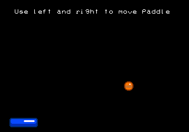
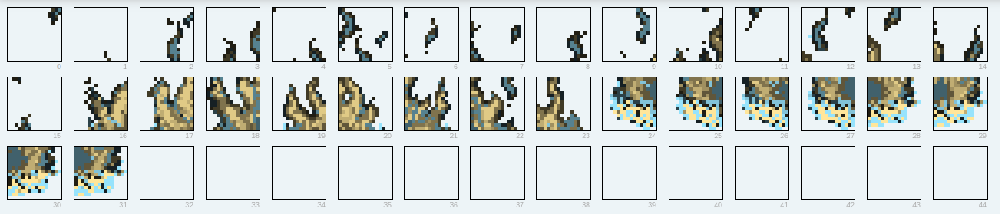
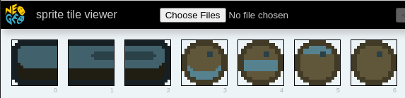

Let's keep going with our little breakout game. This time around we will add the ball. We'll make it bounce around the screen and bounce off of the paddle.



You can find the code for this chapter [in the companion repo](https://github.com/city41/neo-geo-dev-book-game/tree/08-bouncing-ball-part-1).

The main focus of this chapter is to introduce two animation techniques, auto animation and manual animation.

## Auto Animation

Auto animation is a feature of the LSPC. When you set the auto animation flag on a sprite's tile, the LSPC will continually cycle that tile's index, creating either a simple 4 or 8 frame animation, depending on how you configure it. In your C ROM, you need to order the tiles such that when the LSPC cycles through them, a cohesive animation is shown to the user.

<< diagram showing auto animation >>

In sprite control block 1, there are two bits that configure auto animation

<< diagram of scb1 word >>

You can choose either a 4 frame animation by flipping bit 2, or an 8 frame animation via bit 3. If you set both bits, then the 8 frame animation will be chosen.

To accomplish this animation, the LSPC will set the bottom bits of the sprite's tile index based on the current value of the auto animation counter. These bottom bits are blindly overwritten to whatever the counter's current value is. That means in order to accomplish a proper auto animation, your tiles need to be placed on either a multiple of 4 or 8 in the C ROM. Let's look at an example.

<< example >>

### Using Sromcrom to set up auto animation tiles

Over in Sromcrom, we can tell it we want to use auto animation and it will ensure the tiles get positioned in the correct location. Let's add the ball sprite to `resources.json`, and configure it for auto animation

```json
	"cromImages": {
		"inputs": [
			{
				"name": "paddle",
				"imageFile": "./paddle.png"
			},
			{
				"name": "ball",
				"imageFile": "./ball.png",
				"autoAnimation": 4
			}
		]
	}
```

Next to the paddle we specified last chapter, we add the ball. By setting `autoAnimation` to `4`, sromcrom will ensure the ball's tiles get placed properly. We need to ensure the ball has 4 frames of animation


After Sromcrom has built our ROMs, we can see the ball is placed appropriately


In such a simple scenario this isn't too impressive, but sromcrom will always place auto animation tiles properly no matter how complex your game gets. For example, what if we put this camp fire in the game?


This campfire was created by [Zabin](https://opengameart.org/content/camp-fire-animation-for-rpgs-finished). I reduced its colors so it would work on the Neo Geo.

Each frame of the campfire's animation is 2 tiles wide and 4 tall. Each specific chunk of the campfire is placed on proper "multiples of four" boundaries when sromcrom processes it



If you'd like to see how to load this camp fire into a game using sromcrom code generation, checkout supplemental 3.

### Loading the ball into our game

We are continuing with the code we wrote in the last chapter. Along with the previous `load_paddle` we will add `load_ball` to load the ball's sprites into VRAM.

```c
void load_ball() {
    // if you look in paletteDefs.c, you will see the third palette (index 2)
    // is the correct palette for the ball
    const u8 palette = 2;

    // the ball uses auto animation, so this flag will turn it on
    const u8 autoAnimation = 1;

    // set the vram address register to the location for this sprite's tile map
    *REG_VRAMADDR = ADDR_SCB1 + BALL_SPRITE_INDEX * SCB1_SPRITE_ENTRY_SIZE;
    // every time we write to vram, VRAMADDR will increase by one
    *REG_VRAMMOD = 1;

    // set our tile index, in this simple case, our loop variable matches
    // the tiles in our C ROM exactly
    *REG_VRAMRW = 0;
    // set the palette for this tile. This word also allows setting other things
    // such as whether the tile is flipped or not, but we don't need any of that today
    *REG_VRAMRW = palette << 8 | (autoAnimation << 2);

    // move to sprite control bank 2 to set the sprite's scaling
    *REG_VRAMADDR = ADDR_SCB2 + BALL_SPRITE_INDEX;
    // this allows us to jump right into SCB3 and then SCB4 after we write to SCB2
    *REG_VRAMMOD = SCB234_SIZE;

    // set scale (horizontal and vertical)
    *REG_VRAMRW = 0xFFF;

    // now in SCB3, we set the sprite's y location and x location
    // as well as whether it is sticky or not, and its tile height (1 in this simple case)
    *REG_VRAMRW = (TO_SCREEN_Y(ball.y) << 7) | 1;
    // now in SCB4, we set x position
    *REG_VRAMRW = TO_SCREEN_X(ball.x) << 7;
}
```

This code shouldn't be surprising, it is almost identical to all previous code we've written for loading sprites. The only real difference is we set the auto animation bit for 4 frame auto animation

```c
    *REG_VRAMRW = palette << 8 | (autoAnimation << 2);
```

The third bit (shifted two up from the start) is the proper bit we need to turn on for 4 frame auto animation.

That is all we need to do to animate the ball, since the animation is automated, the LSPC just does it for us.

### Move the ball around the screen

We'll close out this part of the chapter by also moving the ball around. We need to keep track of where the ball is, just like we did with the paddle. So we will use the same `Paddle` struct we defined last time. But we will rename it to `Entity` as it is now being used for two different things.

```c
struct Entity
{
    s16 x;
    s16 y;
    s16 velX;
    s16 velY;
};

struct Entity paddle = { .x = 16, .y = 200 };
struct Entity ball = { .x = 152, .y = 32, .velX = 1, .velY = 1 }
```

We also need to keep track of the ball's velocity, so we'll add that to `Entity`. Now that we have a place to keep track of the ball, let's add the function that will move it around

```c
void ball_logic() {
    ball.x += ball.velX;
    ball.y += ball.velY;

    if (ball.x < 0) {
        ball.x = 0;
        ball.velX *= -1;
    }

    if (ball.x > 304) {
        ball.x = 304;
        ball.velX *= -1;
    }

    if (ball.y < 0) {
        ball.y = 0;
        ball.velY *= -1;
    }

    if (ball.y > 208) {
        ball.y = 208;
        ball.velY *= -1;
    }
```

We will call this every frame to move the ball. It merely applies the ball's current velocity to figure out its new location. If the ball hits a side of the screen, we will flip the corresponding velocity to create a very simple bounce effect.

This only moves the ball in memory, we need to move it in VRAM too

```c
void move_ball() {
    // jump to SCB3 for y, then use mod to automatically jump to SCB4 for x
    *REG_VRAMADDR = ADDR_SCB3 + BALL_SPRITE_INDEX;
    *REG_VRAMMOD = SCB234_SIZE;

    // set the new y and also set height to 1 again. since these two values are packed
    // into the same word, we need to make sure we set both here, otherwise the sprite
    // would disappear on screen as height would get set to zero.
    // we don't need to set the sticky bit this time, since we are only working with the
    // control sprite, we know it is not sticky so not setting it here defaults it to zero
    *REG_VRAMRW = (TO_SCREEN_Y(ball.y) << 7) | 1;

    // set new x
    *REG_VRAMRW = TO_SCREEN_X(ball.x) << 7;
}
```

This should look pretty familiar, as we wrote very similar code to move the paddle last chapter.

Now with all of our ball code written, we just need to call it from main

```c
int main() {
    // set the auto animation speed
    *REG_LSPCMODE = (6 << 8);

    init_palettes();
    fix_clear();

    // these two calls are changing VRAM and we have no idea
    // what state the screen is currently in. so these two
    // calls could cause a bit of onscreen garbage. but for
    // this simple demo, it's fine
    fix_print(3, 4, "Use left and right to move paddle");
    load_paddle();
    load_ball();

    for (;;) {
        //  bios_p1current has the current state of player 1's joystick and
        // A, B, C and D buttons. If the CNT_LEFT bit is high, that means left
        // is currently being pressed
        if (bios_p1current & CNT_LEFT) {
            paddle.x -= 3;
        }

        // and same thing for right
        if (bios_p1current & CNT_RIGHT) {
            paddle.x += 3;
        }

        ball_logic();

        // we don't want to change the paddle's sprite location
        // until vblank has occured, that way the screen always
        // appears consistent to the player
        wait_vblank();
        // now that vblank has occured, we have a very small amount of time
        // to update VRAM. thankfully we aren't doing much at all, so we
        // will be just fine
        move_paddle();
        move_ball();
    }

    // we never actually get to this return, but we will
    // in more advanced code examples later
    return 0;
}
```

This `main` is just like last chapter, except we load the ball, and call `ball_logic()` then `move_ball()` every frame to enable the ball to work.

There is one strange line we haven't seen before at the very start of the function

```c
    // set the auto animation speed
    *REG_LSPCMODE = (6 << 8);
```

The `LSPCMODE` register is where we configure how fast auto animation should be.

<<< todo: explain this more >>>

With that, we have finished the code for the auto animation version of the ball. You can see the code [in the companion repo](https://github.com/city41/neo-geo-dev-book-game/blob/08-bouncing-ball-part-1/src/main.c). You should be able to build and run this app. If you hit any issues, check out the repo to see where your code differs.

## Manually animating the ball

Auto animation is a nice feature of the LSPC, but it is very limited. Your animation must have either 4 or 8 frames, and all auto animations run at the same speed. When we set `LSPCMODE` to our desired speed, that impacts all auto animations in the entire game. Ultimately, auto animation is mostly used for "flavor" animations. Just little animations that add a little more flare to your game.

You will need more control and flexibility over most animations in your game, so let's see how we can animate the ball ourself.

## Setting up sromcrom

We need to move our ball image from `cromImages` in resources.json to `cromAnimations`, which we've never used before

```json
"cromAnimations": {
		"codeEmit": {
            "inputs": [
                    {
                            "template": "../src/sromcromTemplates/cromAnimationDefs.h.hbr",
                            "dest": "../src/cromAnimationDefs.h"
                    },
                    {
                            "template": "../src/sromcromTemplates/cromAnimationDefs.c.hbr",
                            "dest": "../src/cromAnimationDefs.c"
                    }
            ]
        },
		"inputs": [
			{
				"name": "ball",
				"animations": [
					{
						"name": "spin",
						"imageFile": "./ball.png",
						"tileWidth": 1,
						"frameDuration": 10
					}
				]
			}
		]
	}
```

Here we create a new animation group called "ball", and inside is a single animation called "spin". cromAnimations are grouped because in a real game it's very common to have a lot of animations for a single entity. For example a player usually has run, climb, attack, etc. We don't technically need `tileWidth`, because it defaults to 1. But it's a good idea to include it. If the ball was wider than one tile, we would need to set this accordingly so that sromcrom can chop the image up into appropriate animation frames.

We also need to do a `codeEmit`, similar to how we did with palettes before.

By moving the ball into `cromAnimations` and not using auto animation, there is no need to ensure the ball's tiles get positioned on a multiple of 4. So now when we look at the C ROM in the sprite viewer, we can see the tiles are in different locations



compare this to the sprite viewer above where the ball tiles come before the paddle tiles.

Sromcrom can decide to put the tiles just about anywhere, in a real game you should never hardcode tile indices, because they will change constantly.

### The code emit templates

We need to write out some C code to be able to know where to find the tiles in our code. Let's start with the easier one, `cromAnimationDefs.h.hbr`, which just creates the header file

```c
#pragma once
#include "animationDef.h"

{{#each animationGroups}}

// start {{name}}

    {{#each animations}}
const struct AnimationDef animationDef_{{../name}}_{{name}};
    {{/each}}

// end {{name}}
{{/each}}
```

sromcrom places an `animationGroups` array in our template, that contains all of the info we need for our animations. Here we just emit one `AnimationDef` per animation. In this simple case, the resulting file looks like this

```c
#pragma once
#include "animationDef.h"


// start ball

const struct AnimationDef animationDef_ball_spin;


// end ball
```

But wait, what is an `AnimationDef`? It is a new struct we will define to hold the animation's definition. In the file `animationDef.h` we will have

```c
#pragma once
#include <ngdevkit/neogeo.h>

struct FrameDef {
    s8 tileIndex;
    s8 paletteIndex;
};

struct AnimationDef {
    const struct FrameDef* frames;
    s8 frameCount;
    s8 frameDuration;
};
```

An animation is made up of frames, so we define a frame definition struct too. This will make more sense after we see how `cromAnimationDefs.c.hbr` plays out, which looks like this

```c
#include "cromAnimationDefs.h"

{{#each animationGroups}}
// start {{name}}

    {{#each animations}}
const struct FrameDef frameDefs_{{../name}}_{{name}}[{{count frames}}] = {
        {{#each frames as |frame|}}
    {
        .tileIndex = {{frame.[0].[0].index}},
        .paletteIndex = {{frame.[0].[0].paletteIndex}},
    }{{#unless @last}},{{/unless}}
        {{/each}}
};

const struct AnimationDef animationDef_{{../name}}_{{name}} = {
    .frames = frameDefs_{{../name}}_{{name}},
    .frameCount = {{count frames}}, 
    .frameDuration = {{default custom.frameDuration 0}}
};

    {{/each}}

// end {{name}}
{{/each}}
```

This is by far the most complicated template we've seen yet. But basically all that is happening is for each animation, we emit its frame definitions, then its animation definition. For our current app, the resulting cromAnimationDefs.c file looks like this

```c
#include "cromAnimationDefs.h"

// start ball

const struct FrameDef frameDefs_ball_spin[4] = {
    {
        .tileIndex = 3,
        .paletteIndex = 2
    },
    {
        .tileIndex = 4,
        .paletteIndex = 2
    },
    {
        .tileIndex = 5,
        .paletteIndex = 2
    },
    {
        .tileIndex = 6,
        .paletteIndex = 2
    }
};

const struct AnimationDef animationDef_ball_spin = {
    .frames = frameDefs_ball_spin,
    .frameCount = 4,
    .frameDuration = 10
};


// end ball
```

Now this is starting to make sense. By using the sprite viewer, we know the ball's tiles are located at 3, 4, 5 and 6, so the `FrameDef` array checks out. Then the AnimationDef for the ball merely points to this array, keeps track of how many frames there are, and also how long each frame should last (ie, how fast the ball animates).

## The ball animation functions

Now that we have the data that defines our ball animation, let's write the functions that will enable us to run the animation. We still need `load_ball`, and it will be almost identical as before, except we don't turn on the auto animation bit. Since that is the only change, I'll skip listing it.

`move_ball` also doesn't change, as moving a sprite's location doesn't have anything to do with the current tiles it is displaying.

We need to store the current state of the ball's animation, so let's define a struct to do that.

```c
struct BallAnimation
{
    u8 currentFrame;
    u8 currentDuration;
};

struct BallAnimation ballAnimation
```

We instantiate one instance of it called `ballAnimation`. GCC will zero out all of the values in the struct, so we don't need to set `currentFrame` or `currentDuration`, as them being zero is what we want.

Every frame we need to update the animation. We need to increment how long the current frame has been displayed, and figure out if we need to move onto the next frame yet or not. That is the job of `ball_animation_logic`

```c
BOOL ball_animation_logic() {
    ballAnimation.currentDuration += 1;

    if (ballAnimation.currentDuration == animationDef_ball_spin.frameDuration) {
        ballAnimation.currentFrame += 1;

        if (ballAnimation.currentFrame == animationDef_ball_spin.frameCount) {
            ballAnimation.currentFrame = 0;
        }

        ballAnimation.currentDuration = 0;

        return TRUE;
    }

    return FALSE;
```

`ball_animation_logic` runs once per iteration of the main game loop. As long as your game isn't having performance issues, the loop will run at 60 fps. In the ball's `AnimationDef`, `frameDuration` is set to 10, so each frame of the ball's animation will display for 1/6th of a second (10 frames, divided by 60 frames per second).

The return value tells us whether or not it's time to move to the next frame of the animation.

Lower down where we update VRAM, we use this boolean value to know if we should change the ball's current tile

```c
	BOOL tileNeedsUpdating = ball_animation_logic();

	...

	wait_vblank();
	move_paddle();
	move_ball();

	if (tileNeedsUpdating) {
		// above ball_animation_logic told us to update the animation
		update_tile_ball();
	}
```

Finally, we just need `update_tile_ball` to change the tile in VRAM

```c
void update_tile_ball() {
    u8 ballTileIndex = animationDef_ball_spin.frames[ballAnimation.currentFrame].tileIndex;
    u8 paletteIndex = animationDef_ball_spin.frames[ballAnimation.currentFrame].paletteIndex;

    // set the vram address register to the location for this sprite's tile map
    *REG_VRAMADDR = ADDR_SCB1 + BALL_SPRITE_INDEX * SCB1_SPRITE_ENTRY_SIZE;
    // every time we write to vram, VRAMADDR will increase by one
    *REG_VRAMMOD = 1;

    // set our tile index
    *REG_VRAMRW = ballTileIndex;
    // set the palette for this tile. This word also allows setting other things
    // such as whether the tile is flipped or not, but we don't need any of that today
    *REG_VRAMRW = paletteIndex << 8;
}
```

And with that, the manual animation version is done. You can see the full code [here in the companion repo](https://github.com/city41/neo-geo-dev-book-game/tree/08-bouncing-ball-part-2).

Manual animation is a lot more work! The Neo Geo itself is only capable of displaying tiles on screen. It is up to us to use that ability to create our own animation system. The one we wrote in this chapter is very simple, but it's enough to get an idea of how a system like this is implemented.
