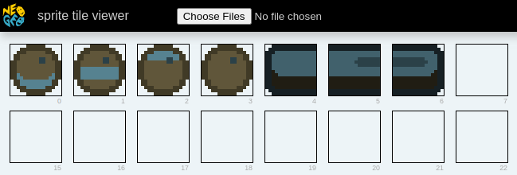

Let's keep going with our little breakout game. This time around we will add the ball. We'll make it bounce around the screen and bounce off of the paddle.


You can find the code for this chapter [in the companion repo](https://github.com/city41/neo-geo-dev-book-game/tree/08-bouncing-ball-part-1).

The main focus of this chapter is to introduce two animation techniques, auto animation and manual animation.

## Auto Animation

Auto animation is a feature of the LSPC. When you set the auto animation flag on a sprite's tile, the LSPC will continually cycle that tile's index, creating either a simple 4 or 8 frame animation, depending on how you configure the tile. In your C ROM, you need to order the tiles such that when the LSPC cycles through them, a cohesive animation is shown to the user.

<< diagram showing auto animation >>

In sprite control block 1, there are two bits that configure auto animation

<< diagram of scb1 word >>

You can choose either a 4 frame animation by flipping bit 2, or an 8 frame animation via bit 3. If you set both bits, then the 8 frame animation will be chosen.

To accomplish this animation, the LSPC will set the bottom bits of the sprite's tile index based on the current value of the auto animation counter. These bottom bits are blindly overwritten to whatever the counter's current value is. That means in order to accomplish a proper auto animation, your tiles need to be placed on either a multiple of 4 or 8 in the C ROM. Let's look at an example.

<< example >>

### Using Sromcrom to set up auto animation tiles

Over in Sromcrom, we can tell it we want to use auto animation and it will ensure the tiles get positioned in the correct location. Let's add the ball sprite to `resources.json`, and configure it for auto animation

```json
	"cromImages": {
		"inputs": [
			{
				"name": "paddle",
				"imageFile": "./paddle.png"
			},
			{
				"name": "ball",
				"imageFile": "./ball.png",
				"autoAnimation": 4
			}
		]
	}
```

Next to the paddle we specified last chapter, we add the ball. By setting `autoAnimation` to `4`, sromcrom will ensure the ball's tiles get placed properly. We need to ensure the ball has 4 frames of animation


After Sromcrom has built our ROMs, we can see the ball is placed appropriately



In such a simple scenario this isn't too impressive, but sromcrom will always place auto animation tiles properly no matter how complex your game gets. For example, what if we put this camp fire in the game?


This campfire was created by [Zabin](https://opengameart.org/content/camp-fire-animation-for-rpgs-finished). I reduced its colors so it would work on the Neo Geo.

Each frame of the campfire's animation is 2 tiles wide and 4 tall. Each specific chunk of the campfire is placed on proper "multiples of four" boundaries when sromcrom processes it


If you'd like to see how to load this camp fire into a game using sromcrom code generation, checkout appendix 3.
