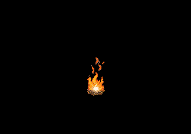

This supplemental walks through loading a more complex auto animation using sromcrom.



The key here is taking advantage of sromcrom to generate code that allows us to load the camp fire's tiles without having to work out their locations in the C ROM. The [companion repo](https://github.com/city41/neo-geo-dev-book-game/tree/supplemental-3-camp-fire/)

## Specifying the camp fire in resources.json

In our `resources.json` file, let's add the camp fire as a cromImage

```json
	"cromImages": {
		"codeEmit": [
				{
						"template": "../src/sromcromTemplates/cromImageDefs.h.ejs",
						"dest": "../src/cromImageDefs.h"
				},
				{
						"template": "../src/sromcromTemplates/cromImageDefs.c.ejs",
						"dest": "../src/cromImageDefs.c"
				}
		],
		"inputs": [
			{
				"name": "campFire",
				"imageFile": "./campFire.png",
				"tileWidth": 2,
				"autoAnimation": 4
			}
		]
	}
```

Notice that the camp fire has `tileWidth` set to 2. This allows sromcrom to figure out that the entire image makes up four frames of animations (since the image is 8 tiles wide)


We are also specifying some new codeEmit templates. Sromcrom will call these templates with all of the information we need to write out data that will let us load our camp fire. Let's start with the header template

```ejs
#pragma once
#include "tileImage.h"

<% images.forEach(function(image) { -%>
const struct TileImageDef <%= image.name %>_cromImageDef;
<% }); -%>
```

Sromcrom passed us an `image` array, each image containing all of the information for a given cromImage. In the header we just declare the `TileImageDef` struct instances for each image, and `TileImageDef` is defined in `tileImage.h`

```c
#pragma once
#include <ngdevkit/neogeo.h>

struct TileDef
{
    const u16 index;
    const u8 palette;
    const u8 autoAnimation;
};

struct TileImageDef
{
    const struct TileDef* tiles;
    const u8 width;
    const u8 height;
};
```

Finally, the c template emits our actual code

```ejs
#include "cromImageDefs.h"

<% images.forEach(function(image, i) { -%>
const struct TileDef <%= image.name %>_tileDefs[<%= image.tiles.flat(1).length %>] = {
<% image.tiles.flat(1).forEach(function(tile, i, a) { -%>
    {
        .index = <%= tile.index %>,
        .palette = <%= tile.paletteIndex %>,
        .autoAnimation = <%= image.autoAnimation || 0 %>
    }<% if (i < a.length - 1) { %>,
<% } -%>
<% }); %>
};
const struct TileImageDef <%= image.name %>_cromImageDef = {
    .tiles = <%= image.name %>_tileDefs,
    .width = <%= image.tiles[0].length %>,
    .height = <%= image.tiles.length %>,
};
<% }); %>
```

This is a more complex template. Each image has an array of tile definitions. These get emitted first, then after the image's struct is emitted. The final resulting will look like this

```c
#include "cromImageDefs.h"

const struct TileDef campFire_tileDefs[8] = {
    {
        .index = 0,
        .palette = 2,
        .autoAnimation = 4
    },
    {
        .index = 4,
        .palette = 2,
        .autoAnimation = 4
    },
    {
        .index = 8,
        .palette = 2,
        .autoAnimation = 4
    },
    {
        .index = 12,
        .palette = 2,
        .autoAnimation = 4
    },
    {
        .index = 16,
        .palette = 2,
        .autoAnimation = 4
    },
    {
        .index = 20,
        .palette = 2,
        .autoAnimation = 4
    },
    {
        .index = 24,
        .palette = 2,
        .autoAnimation = 4
    },
    {
        .index = 28,
        .palette = 2,
        .autoAnimation = 4
    }
};

const struct TileImageDef campFire_cromImageDef = {
    .tiles = campFire_tileDefs,
    .width = 2,
    .height = 4,
};
```

The `TileDef` array tells us where in the C ROM each tile of the campfire is. Notice there are only 8 tiles defined, but in total the campfire has 32 tiles. This is because we are using auto animation. We don't need to worry about the other tiles. When we tell the LSPC to auto animate this sprite, it will load the other tiles at the appropriate time for us.

## Our main code

Finally over in `main.c`, we load the campfire

```c
void load_campfire() {
    const u8 spriteIndex = 0;

    const u8 width = campFire_cromImageDef.width;
    const u8 height = campFire_cromImageDef.height;

    const u16 screenX = 144;
    const u16 screenY = 96;

    // setup each sprite for however wide the campfire is in tiles
    for (u8 tx = 0; tx < width; ++tx) {
        // SCB1: tile definitions
        *REG_VRAMADDR = ADDR_SCB1 + (spriteIndex + tx) * SCB1_SPRITE_ENTRY_SIZE;
        *REG_VRAMMOD = 1;

        u8 sticky = tx != 0;

        // load the tiles for however tall the campfire is
        for (u8 ty = 0; ty < height; ++ty) {
            const struct TileDef* tile = campFire_cromImageDef.tiles + tx + ty * width;
            *REG_VRAMRW = tile->index;

            // here we are specifying auto animation, if you look in cromImageDefs.c, you will
            // see this value is 4. 4 corresponds to the correct bit for setting up a 4 frame
            // auto animation
            *REG_VRAMRW = (tile->palette << 8) | tile->autoAnimation;
        }

        *REG_VRAMMOD = SCB234_SIZE;
        *REG_VRAMADDR = ADDR_SCB2 + spriteIndex + tx;

        // set scale (horizontal and vertical)
        *REG_VRAMRW = 0xfff;

        // y position, sticky bit, height in tiles
        *REG_VRAMRW = (TO_SCREEN_Y(screenY) << 7) | (sticky << 6) | height;
        // x position
        *REG_VRAMRW = TO_SCREEN_X(screenX) << 7;
    }
}
```

There really isn't anything too new or interesting here. Except instead of hard coding tile locations, we just consult `campFire_cromImageDef`.

In `main()`, we set the animation speed by writing to `REG_LSPCMODE`

```c
*REG_LSPCMODE = (4 << 8);
```
