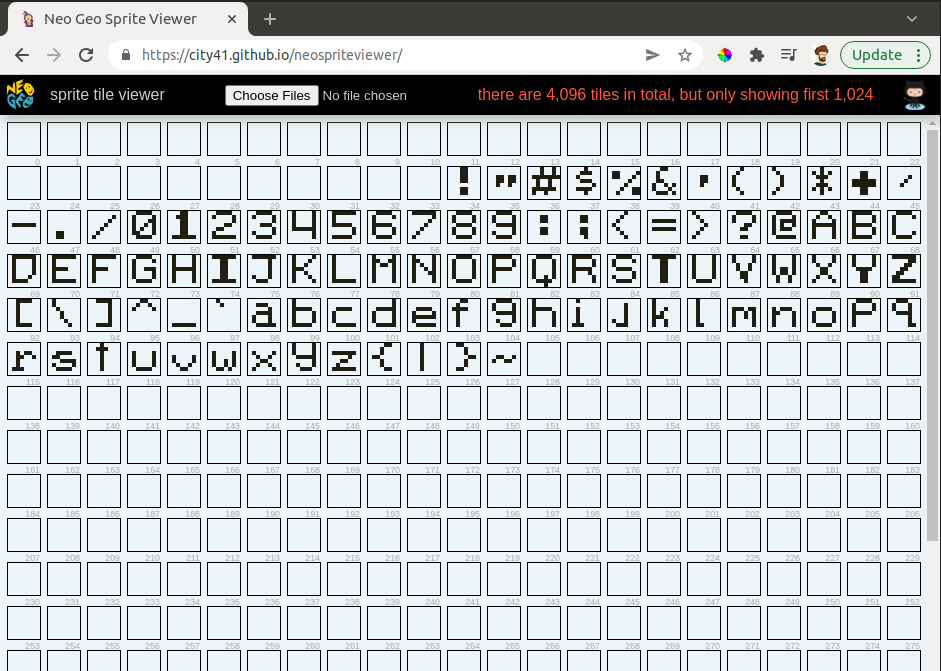

# Hello World

Finally we begin actually coding. We are going to start small, with our only goal being to write a message to the screen.

## What we will be building

Saying "Hello world" is the classic way to start out any programming endeavour. So to kick off Neo Geo programming, we will write a program that displays "Hello Neo Geo!" on the screen


The full program can be found on GitHub at this book's game repo

https://github.com/city41/neo-geo-dev-book-game/tree/04-hello-world

Each chapter in the book will get its own branch.

## Set up your project directory

Create a directory named `helloNeo` and set up its contents like this

```
resources/
src/
configure.ac
Makefile.common
Makefile.config.in
```

`resources` and `src` are just empty directories to start, `configure.ac`, `Makefile.common`,  and `Makefile.config.in` you can copy in from the [ngdevkit-examples project](https://github.com/dciabrin/ngdevkit-examples/)

From this directory in a terminal, run the `autoreconf` command. This will take the `configure.ac` file and create a `configure` script. Once the script is created, run it with `./configure`. `configure` will look at the `Makefile.config.in` file and create a `Makefile.config` file from it based on how ngdevkit is installed on your system.

## Create the Makefile

We need a primary Makefile to drive building and running the game. We lean on ngdevkit to help us here. Create a file named `Makefile` in the `src` directory with this as its contents:

```Makefile
all: cart nullbios

include ../Makefile.config

# ROM names and common targets
include ../Makefile.common

$(CART): $(PROM) $(CROM1) $(CROM2) $(SROM) $(VROM) $(MROM) | rom

OBJS=main
ELF=rom.elf

$(ELF):	$(OBJS:%=%.o)
	$(M68KGCC) -o $@ $^ `pkg-config --libs ngdevkit`

%.o: %.c
	$(M68KGCC) `pkg-config --cflags ngdevkit` -std=c99 -fomit-frame-pointer -g -c $< -o $@


# sound driver ROM: ngdevkit's nullsound
$(MROM): | rom
	$(Z80SDOBJCOPY) -I ihex -O binary $(NULLSOUNDDIR)/nullsound.ihx $@ --pad-to 131072

# sample ROM: empty
$(VROM): | rom
	dd if=/dev/zero bs=1024 count=512 of=$@

# sprite ROM C1 C2: empty
$(CROM1): rom
	dd if=/dev/zero bs=1024 count=512 of=$@

$(CROM2): rom
	dd if=/dev/zero bs=1024 count=512 of=$@

# fixed tile ROM
$(SROM) srom: rom
	cd .. && sromcrom -i resources/resources.json

# program ROM
$(PROM): $(ELF) | rom
	$(M68KOBJCOPY) -O binary -S -R .comment $< $@ && dd if=$@ of=$@ conv=notrunc,swab

clean:
	rm -f *.png *.o *~ $(ELF) tmp.* rom/*.*

.PHONY: clean

```

This file is nuts, especially if you're not experienced with Make. Let's ignore the details for now, we'll dive into ngdevkit's makefiles later.


## Create the S ROM containing a font

The Neo Geo has no built in way to display any kind of letters or numbers. The only thing it can do is show graphic tiles on the screen. Before our app can print out a message, we need to set up some of these tiles to serve as a font.

We will be sromcrom to convert png files into tiles. First, in the `resources` directory, add a file named `resources.json` like this:

```json
{
	"romPathRoot": "../src/rom/202-",
	"sromImages": {
		"inputs": [
			{
				"name": "font",
				"imageFile": "./fixFont.png"
			}
		]
	}
}
```

sromcrom will read this file and generate tile data accordingly. `romPathRoot` tells sromcrom where to write the ROM files and it is relative to the location of the resources.json file. Since we are generating an S ROM file, a single file will be written to `../src/rom/202-s1.s1`. If we were also generating C ROMs for sprites, then the files `../src/rom/202-c1.c1` and `../src/rom/202-c2.c2` would also be written. 

<div class="callout">
Why the "202-" prefix? 202 is the NGH number for Puzzle De Pon. We are pretending our game is Puzzle De Pon so that emulators will load it. MAME especially was written to assume only the known commercial games will ever get ran, so we need to pretend to be a commercial game to trick MAME into running our game.
</div>

The `sromImages` entry is where we tell sromcrom which image files to use to generate the tiles that will go into the S ROM file. We only have one this time, `fixFont.png`. Let's go ahead and create it. You can copy this image into your resources directory to serve as `fixFont.png`


As you can see it's just a small font, with each character being 8x8 pixels in size. The magenta color is how we specify transparency, there won't be any magenta displayed in the running game.

### run sromcrom and check the results

We are now ready to have sromcrom generate our S ROM for us. We can do that by invoking `make srom` inside the `src` directory. 

You should see a little bit of output from sromcrom:

```bash
$ make srom
mkdir rom
cd .. && sromcrom -i resources/resources.json
wrote /home/matt/dev/helloNeo/src/rom/202-s1.s1
```

And if you look inside `src/rom`, you should indeed find the s1 file. Head on over to https://city41.github.io/neospriteviewer and load this s1 file:



Excellent! Our font has been converted into tiles and is ready to go.

<div class="callout">
Why are the first 33 tiles skipped? Actually only 32 tiles are skipped, the 33rd tile is "space". The skipped tiles are due to how the Neo Geo does its "eyecatcher", the screen with the Neo Geo logo and the "MAX 330 PRO GEAR SPEC" tagline. We'll fully cover the eyecatcher later, but for now just know skipping those tiles was intentional.
</div>


### Translating ASCII to tiles

In our C program, when we create a string such as `"Hello Neo Geo!"`, it will encode those characters into ASCII. ASCII is just a mapping from numbers to characters, for example capital `A` is 65 in ASCII.


Source: Wikipedia, released to the public domain

The first character in ASCII that we care about is space, which is number 32. If you compare the table to the fixFont.png image above, you'll see they match each other.

Sromcrom's space tile is at index 33, just off by one from ASCII. So to display text on the Neo Geo using or S ROM file, we just need to take the ASCII code and add one to it to get the corresponding tile index. 

## How to set tiles on the fix layer

We now know how to pick the tiles to display on the screen, but how do we actually display them? That is where the Neo Geo's Video RAM comes into play.

You can think of the Neo Geo's graphics as being *declarative*. We simply tell the Neo Geo "place tile 34 at this location", and the hardware will do it for us. This is done by setting values in Video RAM.

But we don't have direct access to the video RAM. Instead, the 68k's memory map has various registers that allow us to interact with video RAM.

<div class="callout">
<h3>What is a memory map? What is a register?</h3>
No worries, they are both covered in detail in the next chapter. Feel free to skip ahead and come back here if you are curious.
</div>

Here are the registers we will need to draw our tiles

| Address  | Name         | Description                                                        |
|----------|--------------|--------------------------------------------------------------------|
| 0x3c0000 | REG_VRAMADDR | Sets the current video RAM address we want to either read or write | 
| 0x3c0002 | REG_VRAMRW   | Read or write to the address that was set in REG_VRAMADDR          |
| 0x3c0004 | REG_VRAMMOD  | After writing to REG_VRAMRW, REG_VRAMADDR will jump ahead by the amount specified in this register |

And finally, we need the address of the fix map in video RAM, which is 0x7000. Thankfully, ngdevkit has named that address `ADDR_FIXMAP` so we don't have to remember it. The fix map is a chunk of memory storing which tiles are currently being drawn on the fix layer. It starts at the upper left corner and reads top to bottom, then left to right. The fix layer has a total size of 40 tiles wide by 32 tiles tall. But it is recommended to only place tiles in the central 38x28 portion of the layer as tiles on the edge can get cut off on some displays.

### Placing a single tile in the fix layer

Let's say we want to draw `@` in the fix layer at x=10 and y=14. Here is what we need to do:

1. Determine `@` tile index, which is 65.
2. Figure out how far into the fix map corresponds to the tile at (10,14)
    * This is (x * 32) + y, which is 334
3. Set `REG_VRAMADDR` to this value, in C this would be `*REG_VRAMADDR = ADDR_FIXMAP + 334;`
4. Write `65` to `REG_VRAMRW`, ie `*REG_VRAMRW = 65;`

This is a bit simplified because it is ignoring palettes, but we'll get there in due time.

## Writing the Hello World app in C

We are now finally ready to write some actual code. Create the file `src/main.c` and start it out with this:

```C
#include <ngdevkit/neogeo.h>

int main() {
}
```

We pull in the main ngdevkit header file so we can access it, you will do this in almost all source files in a Neo Geo game. We also declare `main`, which is the function that will get invoked when the system is ready to run our game.

We need to:

* initialize a palette
* clear the fix layer, in case video RAM has garbage values in it
* draw our message on the screen

That will look something like this

```C
#include <ngdevkit/neogeo.h>

int main() {
	init_palette();
	fix_clear();

	fix_print(10, 14, "Hello Neo Geo!");
}
```

Let's go ahead and start creating these functions.

### init_palette()

Palettes are stored in regular RAM, not video RAM. Palettes start at address 0x400000, which ngdevkit has named `MMAP_PALBANK1`. To initialize a palette, we just need to write some colors to this address

```C
#define BLACK 0x8000
#define WHITE 0x7FFF
#define PALETTE_SIZE 2

const u16 palette[PALETTE_SIZE] = { BLACK, WHITE };

void init_palette() {
    for (u8 i = 0; i < PALETTE_SIZE; ++i) {
        MMAP_PALBANK1[i] = palette[i];
    }
}
```

Here we have defined a two color palette and a function which will write it into memory. Don't worry too much about why black is `0x8000` and white is `0x7FFF`, we'll talk about colors later.

### fix_clear()

By the time our game is running, the system has probably already used the fix layer for the eyecatcher. We need to erase everything in the fix layer, so our `fix_clear` does just that:

```C
void fix_clear() {
    u8 palette = 0;
    u16 tileValue = (palette << 12) | 0xFF;

    *REG_VRAMADDR = ADDR_FIXMAP;
    *REG_VRAMMOD = 1;

    for (u16 i = 0; i < 40 * 32; ++i) {
        *REG_VRAMRW = tileValue;
    }
}
```

When telling the fix layer what tile to use, you need to give it both a tile index and a palette index. This is done by taking both values and combining them into one, by shifting the palette's index up to bits 12 through 15 of the 16 bit value

<<< diagram showing the combined values >>>

In our case we are using the palette at index 0, so we don't actually need to do this, as the top bits will default to zero. You will later see that combining various chunks of data into one 16 bit word is very common on the Neo.

Then we set `REG_VRAMADDR` to the fix map's address. Remember, `REG_VRAMADDR` is the register that we use to tell the Neo Geo where in video RAM we want to read or write values.

We then set `REG_VRAMMOD` to 1. This means every time we send a value to `REG_VRAMRW`, the system will then bump the address that `REG_VRAMADDR` is set to by one word (two bytes). This allows us to just keep sending values to `REG_VRAMRW` repeatedly and the system will keep incrementing the address for us.

Finally the for loop takes this value, and writes it into video ram 1,280 times, which is 40 * 32, which is how many tiles across (40) and tall (32) the fix layer is.

<div class="callout">
<h3>Video RAM words</h3>
<p>In video RAM, all writes are done in 16 bit words. You can never write a single byte to video RAM. Whenever you send a value, it will always be 16 bits. Also whenever you set REG_VRAMMOD to 1, it means "bump the address by one word".
</div>

But why are we setting the tile index to 0xFF? For reasons we'll get to later in the book, the tile at 0xFF in an S ROM is assumed to be blank. This is true in our S ROM too (you can see it in the screenshot of the tile viewer above). Since 0xFF should be blank, it is a good candidate for clearing out the fix layer.

<div class="pitfall">
The tile at 0xFF <i>should</i> be blank but nothing enforces that. If your S ROM has some graphics in this tile, you'll likely see that tile dumped all over the place during the eyecatcher and such.
</div>

### fix_print()

And finally we need to implement the function that sets our message into the fix layer

```C
void fix_print(u16 x, u16 y, const u8* text) {
    *REG_VRAMADDR = ADDR_FIXMAP + (x * 32) + y;
    *REG_VRAMMOD = 32;

    u8 palette = 0;

    while (*text) {
        u16 tileIndex = *text + 1;
        *REG_VRAMRW = (palette << 12) | tileIndex;

        text += 1;
    }
}
```

First we tell the Neo Geo we want to change the fix map by setting `REG_VRAMADDR` to a location within the fix map. That location is the start of the map (`ADDR_FIXMAP`), plus how ever much we need to move within the map to arrive at our desired (x,y) location. Since the fix layer is 32 tiles tall and column oriented, we can get the address we need by multiplying x by 32 and adding on y.

Everytime we set one tile, we want to move over by one in the x direction. We accomplish this by setting `REG_VRAMMOD` to 32. Since the fix map is stored in columns, by jumping ahead 32 spots, we end up in the next column over, next to where we just were.

`text` is a classic C char string. In main when we call `fix_print(10, 14, "Hello Neo Geo !")`, the compiler takes `"Hello Neo Geo!"` and converts it into an array of bytes, and slaps a zero on the end of it. This is identical to how strings are formed in just about any C program.

The while loop looks at each character in `text` one by one, and adds one to its value to arrive at the tile we need (remember our S ROM's font tiles are placed such that they are off by ASCII encoding by 1).

### Putting it all together

At this point we have written the entire program. Except there is one more thing we need to do. After we have put our message on the fix layer, we have to keep our game running so that we can see the message. The 68k processor will not stop, it needs to keep running instruction as long as the console is turned on. So for this simple program, we end with an infinite loop to keep the processor busy. With that in mind, the final program is:

```C
#include <ngdevkit/neogeo.h>

#define BLACK 0x8000
#define WHITE 0x7FFF

#define PALETTE_SIZE 2
const u16 palette[PALETTE_SIZE] = { BLACK, WHITE };

void init_palette() {
    for (u8 i = 0; i < PALETTE_SIZE; ++i) {
        MMAP_PALBANK1[i] = palette[i];
    }
}

void fix_clear() {
    u8 palette = 0;
    u16 tileValue = (palette << 12) | 0xFF;

    *REG_VRAMADDR = ADDR_FIXMAP;
    *REG_VRAMMOD = 1;

    for (u16 i = 0; i < 40 * 32; ++i) {
        *REG_VRAMRW = tileValue;
    }
}

void fix_print(u16 x, u16 y, const u8* text) {
    *REG_VRAMADDR = ADDR_FIXMAP + (x * 32) + y;
    *REG_VRAMMOD = 32;

    u8 palette = 0;

    while (*text) {
        // the S ROM used by this game has the tiles stored just one
        // off from the ASCII encoding, so we add a one to get the
        // tile index we need.
        u16 tileIndex = *text + 1;
        *REG_VRAMRW = (palette << 12) | tileIndex;

        text += 1;
    }
}

int main() {
    init_palette();
    fix_clear();

    fix_print(10, 14, "Hello Neo Geo!");

    // the infinite loop that allows our game to keep running
    for (;;) { }

    // we never actually get to this return, but returning an int
    // is expected for main() in most C environments
    return 0;
}
```

You can find this code [here in the book's companion repo](https://github.com/city41/neo-geo-dev-book-game/blob/04-hello-world/src/main.c).

## Compiling and running our program

Finally we can compile and run our program. Makes sure you are in the `src/` directory and invoke `make`. This will compile the C code and do all the other needed steps to build out an entire Neo Geo ROM of our program. If you get any errors, see what the error says and see if you can figure out what you did wrong. If you get stuck, you can use the [companion repo](https://github.com/city41/neo-geo-dev-book-game/blob/04-hello-world/src/main.c) as a reference.

Finally, invoke `make gngeo` to see your game running in the emulator.

Congrats! Your first Neo Geo program!


